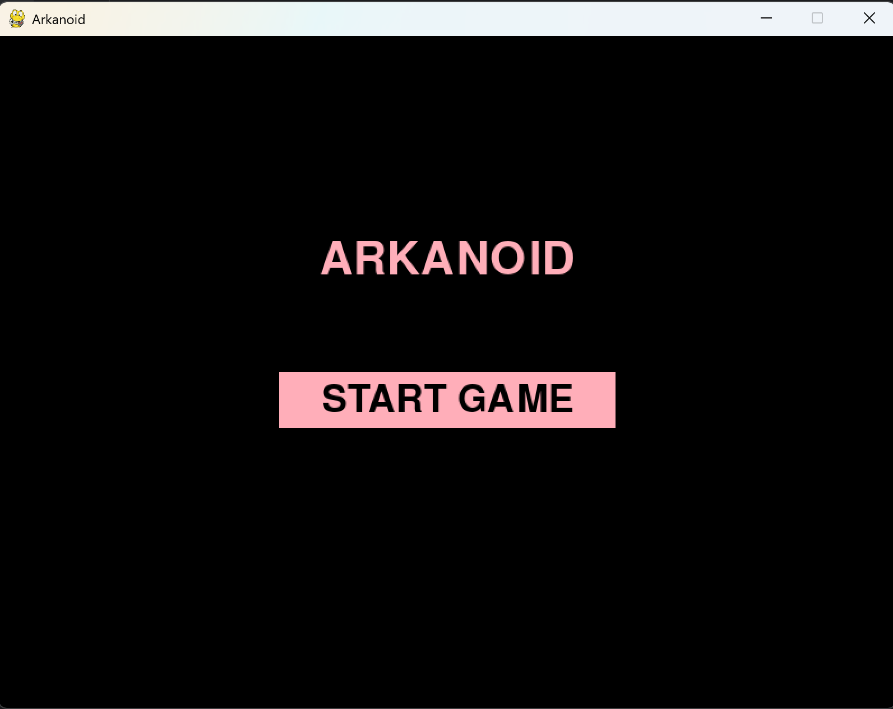
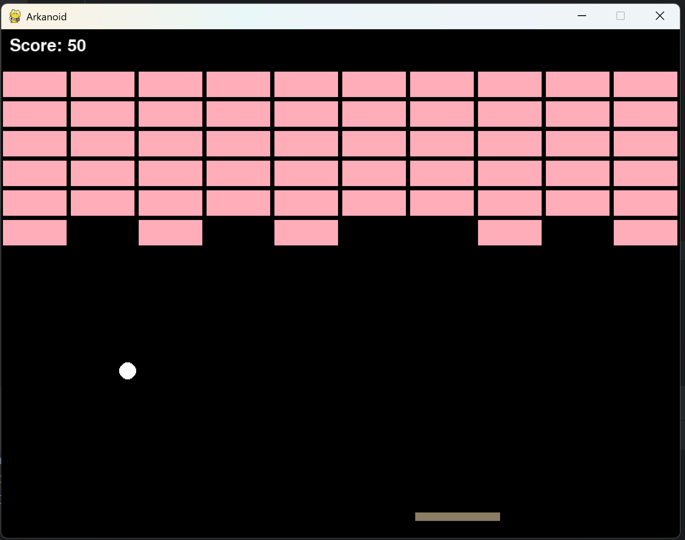
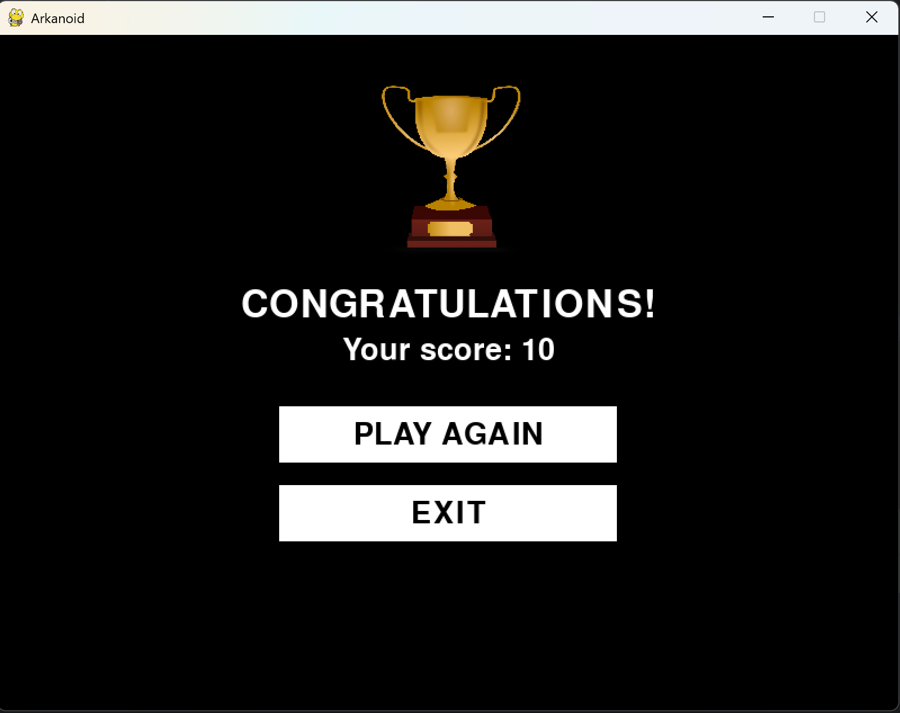
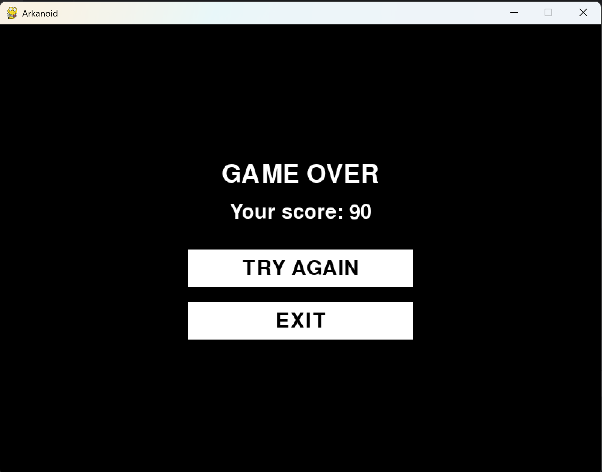

# Arkanoid - Python Game

A simple Arkanoid game built in Python using Pygame. The goal is to break all the bricks using a bouncing ball while preventing it from falling off the screen.


## 📜 Features

- Classic Arkanoid gameplay
- Increasing bifficulty - the ball speeds up every 80 points
- Start Screen, Game Over Screen and Win Screen
- Hover effects on buttons
- Trophy image on the win screen 🏆
- Simple and clear object-oriented structure


## 📂 File Structure
```
/arkanoid
│── /assets             # Folder for images (e.g., trophy.png)
│── /screens            # Different game screens
│    ├── menu.py        # Handles the main menu screen (Start button, UI effects)
│    ├── game_over.py   # Displays "Game Over" screen with score and buttons
│    ├── win_screen.py  # Displays "You Won" screen with a trophy image
│── /objects            # Game objects
│    ├── ball.py        # Ball class - movement, collisions, speed increase
│    ├── paddle.py      # Paddle class - controlled by the player
│    ├── brick.py       # Brick class - defines breakable bricks
│    ├── score.py       # Score class - tracks and displays score
│── settings.py         # Game settings - screen size, colors, FPS, etc.
│── game.py             # Main game logic - handles updates, collisions, and win/loss conditions
│── main.py             # Entry point - runs the game, handles screen transitions
│── README.md           # Documentation
│── requirements.txt    # Python dependencies
```


## 🛠️ Installation & Setup

### 1. Clone the repository
```bash
  git clone https://github.com/Andebska/Arkanoid.git
  cd arkanoid
```
### 2. Install dependencies
```bash
  pip install -r requirements.txt
```
### 3. Run the game
```bash
  python main.py
```
## 🎮 How to Play?

🕹️ **Move the paddle** - Use Left Arrow (←) and Right Arrow (→) keys

🎯 **Break all bricks** - Use the ball to destroy bricks 

⚡ **Difficulty increases** - Every 80 points, the ball speeds up

🚀 **Win the game** - Destroy all bricks to see the Victory Screen

💀 **Lose the game** - If the ball falls below the paddle


## 📝 Code Documentation

### 🟢 Objects  

#### 🔹 Ball (`objects/ball.py`)  
The **ball** moves across the screen, bounces off walls, bricks, and the paddle.  
- `move()`: Updates ball position and handles collisions  
- `increase_speed()`: Speeds up the ball after every 80 points  

#### 🔹 Paddle (`objects/paddle.py`)  
The **paddle** is controlled by the player and bounces the ball back into play.  
- `move(keys)`: Moves left/right based on player input  

#### 🔹 Brick (`objects/brick.py`)  
**Bricks** disappear when hit by the ball.  
- `destroyed`: A flag to check if a brick is broken  

#### 🔹 Score (`objects/score.py`)  
Manages and displays the player’s score.  
- `add_points(amount)`: Increases score when bricks are broken 

### 📺 Screens

#### 🔹 Menu (`screens/menu.py`)
Handles the **main menu screen**, including:
- "Start Game" button (with hover effect)
- Background display

### 🔹 Game Over Screen (`screens/game_over.py`)  
Shows the **Game Over** message with:  
- Final score  
- "Try Again" and "Exit" buttons (with hover effects)  

### 🔹 Win Screen (`screens/win_screen.py`)  
Displays **"Congratulations, You Won!"** message along with a trophy image. 

## ⚙️ Core Logic  

### 🔹 Settings (`settings.py`)  
Stores global **game settings**, such as:  
- Screen size  
- Colors  
- Frames per second (FPS)  

### 🔹 Game (`game.py`)  
Handles the **main game logic**, including:  
- Updating objects  
- Collision detection  
- Win/loss conditions  

### 🔹 Main (`main.py`)  
The **entry point** of the game:  
- Runs the game loop  
- Switches between different screens  


## 📸 Screenshots

| Start Screen | Game Screen | Win Screen | Game Over Screen |
|-------------|-------------|-------------|-------------|
|  |  |  |  |

